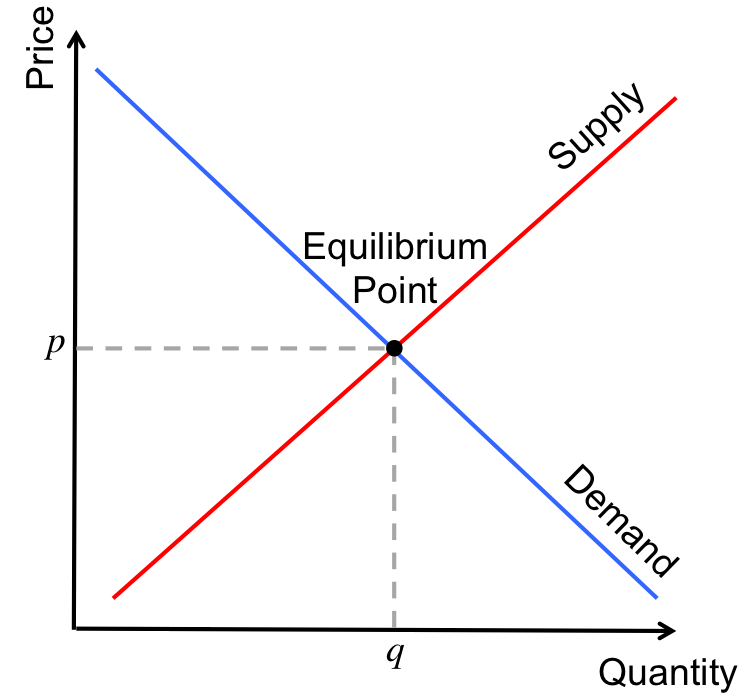

# The Economics of Business

## Learning Objectives
1) Explain capitalism
2) Explain socialism and communism
3) Compare different systems
4) Analyze trend towards mixed economies
5) Describe the economic system of US, incl. significance of key econ. indicators
    - GDP
    - Productivity
    - Business Cycle
6) Contrast fiscal policy / monetary policy

## Economics
study of how society emplohys resources to produce goods and services for consumption amoung various groups and individuals

### Macroeconomics
Concentrates on the operation of a nation's economy as a whole

### Microeconomics
Concentrates on the behavior of people and the orgnaization in markets for particular products or services.

### Resource Development
The study of how to increase resources and create conditions that will make better use of them

#### Examples of ways to increase resources:
```
hydrogen fuel
hydroponics
aquaculture
nanotechnology
```

### Thomas Malthus
"The Dismal Science" if rich had most of wealth and poor had most of population, resources would run out. Believed in population control.

### Population as a recource
Contrary to Malthus, some economists perceive population as a resource, an educated population is hihgly valuable

Business ownders provide jobs and economic growth for their employees and communities as well as for themselves

### Adam Smith
- Father of economics
- Freedom was vital to any economy's survival
- Freedom to own land or property and the right to keep the profits of a business is essential
- People will work hard if they believe they will be rewarded

## The Invisible Hand Theory
As people improve their own situation in life, they help the economy prosper through the production of goods, services, and ideas
```
"When self-directed gain leads to social and economic benefits for the whole community"
```

## Capitalism
All or most of the land, factories, and stores are owned by individuals, not the government, and operated for profit.

### Examples:
- United States
- England
- Australia
- Canada

## State Capitalism
When the state, rather than private owners, run some businesses

### Examples:
- China
- Russia

These Countries have experienced some success using capitalistic principles, but the future is still uncertain

### Capitalism Basic Rights
1) Right to Private Property: Individuals can own, use, buy, sell, and bequeath land, machinery, and other assets. This is considered the most fundamental right.
2) Right to Own a Business and Profits: Individuals can operate businesses, retain all profits, and use them as incentives to drive production.
3) Freedom of Competition: Markets allow for many independent buyers and sellers, fostering innovation and efficiency.
4) Freedom of Choice: Individuals have the freedom to choose their employment, what to consume, and where to invest, ensuring voluntary,, non-coerced transactions.

### Free Markets
Decisions about what and how much to produce are made by the market

Consumers send signals about what they liek and how they like it

Price tells companies how much of a prodyct they should product

If something is wanted but hard to get, the price will rise until more products are available

## Supply and Demand Curves


## Equilibrium Point
The point at which supply and demand meet determines price

Market Price (Equilibrium Point) determined by supply and demand, this is the negotiated price

### Four Degrees of Competition
1) Perfect Competition (Farmer's Market)
2) Monopolistic Competition (Sneakers)
3) Oligopoly (Airlines)
4) Monopoly (PGE)

### Free Market Benefits and Limitation
- Allows for open competition among companies
- Provides opportunities for poor people to work their way out of poverty
- People may let greed drive them
